```python
from sklearn.datasets import make_blobs
from sklearn.cluster import KMeans
import matplotlib.pyplot as plt
plt.style.use('ggplot')
plt.xkcd();
```


```python
cords, cluster = make_blobs(n_samples=1000, n_features=2, centers=4, cluster_std = 1, random_state = 1)
```


```python
cords
```


    array([[-10.45765533,  -3.30899488],
           [ -5.90962043,  -7.80717036],
           [ -1.00497975,   4.35530142],
           ...,
           [ -4.45264491,   6.34401868],
           [ -2.44147159,   3.96898089],
           [ -9.48677473,  -2.24268671]])


```python
cluster
```


    array([1, 2, 0, 3, 2, 3, 3, 3, 0, 1, 1, 3, 0, 0, 3, 3, 3, 1, 3, 2, 1, 3,
           1, 0, 1, 3, 2, 1, 0, 1, 2, 2, 2, 2, 0, 0, 0, 0, 1, 1, 1, 0, 1, 3,
           2, 2, 3, 0, 2, 2, 0, 1, 3, 1, 0, 1, 3, 1, 2, 0, 2, 2, 3, 2, 1, 0,
           0, 0, 0, 2, 3, 2, 3, 3, 2, 0, 3, 1, 0, 3, 2, 2, 1, 0, 0, 1, 0, 2,
           0, 3, 2, 0, 3, 0, 3, 3, 0, 1, 3, 1, 3, 2, 0, 3, 1, 3, 1, 3, 3, 0,
           3, 3, 1, 0, 2, 3, 0, 3, 3, 1, 3, 0, 3, 3, 2, 2, 0, 2, 0, 0, 0, 1,
           0, 1, 2, 3, 1, 1, 2, 3, 2, 1, 1, 3, 1, 0, 3, 1, 1, 2, 1, 0, 2, 0,
           1, 3, 1, 1, 2, 2, 2, 3, 0, 2, 1, 1, 0, 2, 3, 3, 1, 1, 2, 2, 1, 1,
           3, 3, 2, 2, 1, 2, 3, 1, 2, 0, 2, 3, 2, 0, 0, 2, 3, 2, 3, 0, 1, 1,
           0, 3, 3, 2, 2, 1, 3, 3, 1, 0, 1, 0, 3, 0, 2, 1, 2, 3, 0, 0, 1, 0,
           3, 2, 2, 3, 0, 2, 0, 3, 1, 1, 3, 0, 3, 1, 0, 3, 0, 1, 2, 0, 0, 1,
           3, 0, 0, 2, 2, 0, 3, 0, 2, 1, 0, 0, 3, 2, 2, 0, 2, 2, 0, 2, 2, 3,
           2, 3, 2, 2, 3, 2, 0, 3, 1, 3, 3, 0, 0, 1, 1, 1, 0, 1, 0, 1, 2, 3,
           0, 3, 2, 3, 1, 0, 0, 3, 1, 0, 2, 2, 1, 0, 2, 2, 3, 1, 1, 1, 1, 1,
           1, 1, 1, 3, 0, 0, 2, 3, 3, 0, 2, 2, 1, 2, 0, 0, 3, 3, 0, 1, 1, 1,
           3, 2, 3, 2, 3, 0, 3, 0, 2, 1, 1, 2, 0, 3, 3, 2, 3, 3, 3, 2, 3, 0,
           3, 1, 2, 1, 0, 2, 2, 2, 3, 1, 3, 3, 1, 3, 2, 3, 3, 3, 3, 1, 1, 2,
           0, 0, 0, 1, 2, 3, 0, 2, 1, 2, 2, 0, 3, 3, 1, 0, 2, 0, 1, 0, 2, 2,
           2, 2, 2, 3, 1, 1, 3, 2, 2, 2, 2, 2, 0, 1, 3, 0, 2, 3, 3, 1, 0, 1,
           2, 3, 3, 3, 1, 0, 0, 1, 2, 2, 0, 1, 1, 1, 2, 2, 3, 0, 2, 2, 2, 3,
           1, 2, 3, 2, 0, 3, 0, 2, 0, 2, 3, 1, 3, 1, 0, 1, 2, 2, 0, 3, 2, 3,
           0, 1, 3, 2, 2, 3, 0, 1, 1, 3, 1, 3, 0, 2, 3, 1, 2, 1, 2, 1, 1, 2,
           0, 3, 1, 0, 3, 0, 3, 2, 2, 1, 1, 0, 0, 3, 1, 1, 0, 3, 3, 0, 0, 0,
           1, 1, 2, 1, 1, 1, 2, 0, 2, 0, 1, 1, 2, 2, 3, 2, 1, 0, 3, 1, 3, 1,
           0, 3, 2, 1, 1, 3, 0, 3, 1, 3, 0, 3, 2, 0, 2, 0, 0, 0, 1, 2, 3, 3,
           1, 0, 2, 3, 2, 2, 2, 3, 0, 3, 2, 1, 3, 3, 2, 2, 1, 2, 3, 3, 0, 1,
           3, 2, 3, 3, 3, 2, 3, 1, 1, 1, 3, 1, 2, 0, 0, 0, 1, 3, 3, 0, 0, 2,
           1, 0, 1, 1, 3, 3, 2, 2, 1, 2, 3, 3, 1, 3, 0, 3, 0, 2, 0, 3, 1, 2,
           1, 0, 1, 1, 1, 1, 0, 1, 3, 1, 1, 0, 2, 3, 2, 1, 0, 0, 3, 0, 1, 1,
           3, 0, 3, 3, 2, 2, 0, 2, 0, 0, 0, 0, 3, 3, 1, 1, 3, 2, 2, 0, 0, 0,
           2, 2, 2, 1, 0, 3, 3, 1, 2, 2, 2, 1, 2, 0, 2, 1, 2, 3, 0, 0, 1, 2,
           2, 2, 1, 2, 1, 1, 3, 1, 0, 2, 1, 3, 1, 0, 3, 3, 0, 1, 0, 3, 0, 0,
           1, 1, 1, 2, 0, 0, 2, 2, 1, 0, 3, 2, 2, 0, 0, 1, 2, 3, 1, 2, 3, 2,
           1, 3, 1, 0, 0, 1, 0, 3, 2, 0, 1, 3, 0, 3, 2, 1, 3, 2, 1, 3, 1, 0,
           1, 3, 2, 2, 0, 0, 0, 3, 2, 3, 3, 3, 1, 0, 3, 2, 3, 3, 3, 1, 0, 2,
           2, 0, 0, 0, 3, 0, 1, 1, 2, 1, 1, 0, 2, 1, 3, 1, 3, 1, 1, 1, 0, 2,
           3, 2, 1, 1, 1, 1, 3, 2, 2, 0, 3, 0, 2, 1, 0, 2, 2, 0, 3, 3, 1, 0,
           2, 3, 0, 2, 3, 1, 2, 3, 1, 2, 1, 1, 2, 3, 2, 2, 1, 3, 0, 1, 3, 0,
           3, 3, 0, 3, 2, 0, 3, 1, 0, 2, 3, 2, 0, 1, 0, 0, 0, 3, 2, 2, 1, 0,
           0, 3, 1, 3, 3, 1, 1, 2, 2, 0, 0, 3, 3, 1, 3, 0, 2, 0, 0, 1, 2, 1,
           1, 2, 0, 3, 2, 1, 3, 3, 3, 2, 1, 3, 1, 3, 2, 1, 0, 1, 0, 2, 2, 1,
           0, 3, 3, 0, 2, 1, 3, 3, 0, 0, 0, 0, 0, 1, 1, 1, 2, 1, 3, 0, 0, 2,
           0, 1, 0, 0, 2, 2, 0, 3, 0, 0, 1, 2, 1, 2, 0, 0, 2, 2, 1, 0, 2, 3,
           1, 0, 2, 1, 0, 2, 3, 2, 2, 3, 0, 1, 3, 2, 1, 0, 1, 2, 1, 0, 0, 2,
           1, 0, 2, 3, 3, 1, 3, 2, 0, 1, 2, 0, 3, 1, 2, 3, 0, 3, 0, 3, 1, 0,
           3, 2, 0, 0, 2, 1, 2, 0, 0, 1])


```python
plt.figure(figsize = (12, 8))
plt.scatter(cords[:, 0], cords[:, 1])
plt.show()
```


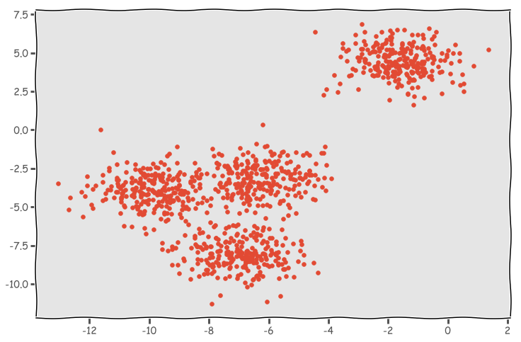


```python
plt.figure(figsize = (12, 8))
plt.scatter(cords[:, 0], cords[:, 1], c = cluster)
plt.show()
```


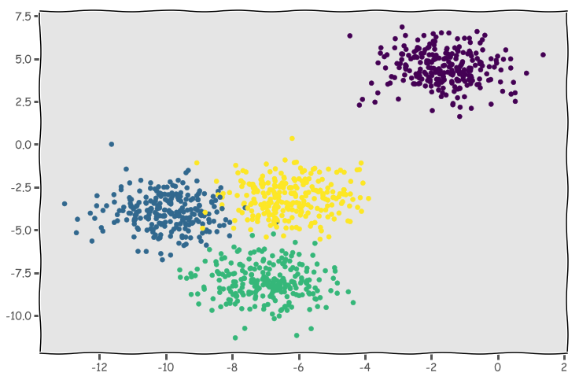


```python
kmeans = KMeans(n_clusters = 4)
kmeans.fit(cords)
pred_clusters = kmeans.predict(cords)
```


```python
kmeans.cluster_centers_
```


    array([[-9.90492947, -3.93364804],
           [-1.61415955,  4.45930385],
           [-6.98123763, -8.09932345],
           [-6.20731359, -3.15128342]])


```python
plt.figure(figsize = (12, 8))
plt.scatter(cords[:, 0], cords[:, 1], c = cluster)
plt.scatter(kmeans.cluster_centers_[:, 0], kmeans.cluster_centers_[:,1], color = 'red', s = 200)
plt.show()
```


```python
from sklearn.metrics import calinski_harabaz_score
```


```python
calinski_harabaz_score(cords, pred_clusters)
```


    4948.187440568203


```python
kmeans = KMeans(n_clusters = 6)
kmeans.fit(cords)
pred_clusters = kmeans.predict(cords)
```


```python
calinski_harabaz_score(cords, pred_clusters)
```


    3692.7189910168777


```python
plt.figure(figsize = (12, 8))
plt.scatter(cords[:, 0], cords[:, 1], c = pred_clusters)
plt.scatter(kmeans.cluster_centers_[:, 0], kmeans.cluster_centers_[:,1], color = 'red', s = 200)
plt.show()
```


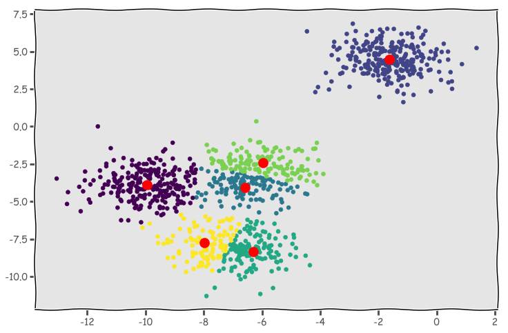


```python
my_scores = []

for x in range(2, 10):
    kmeans = KMeans(n_clusters = x)
    kmeans.fit(cords)
    pred_clusters = kmeans.predict(cords)
    my_scores.append(calinski_harabaz_score(cords, pred_clusters))
```


```python
plt.figure(figsize = (12, 8))
plt.plot(range(2, 10), my_scores)
plt.show()
```


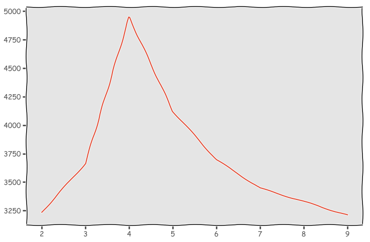


```python
import pandas as pd
```


```python
df = pd.read_csv('Seasons_Stats.csv')
```


```python
df.head()
```


<div>
<style scoped>
    .dataframe tbody tr th:only-of-type {
        vertical-align: middle;
    }

    .dataframe tbody tr th {
        vertical-align: top;
    }

    .dataframe thead th {
        text-align: right;
    }
</style>
<table border="1" class="dataframe">
  <thead>
    <tr style="text-align: right;">
      <th></th>
      <th>Unnamed: 0</th>
      <th>Year</th>
      <th>Player</th>
      <th>Pos</th>
      <th>Age</th>
      <th>Tm</th>
      <th>G</th>
      <th>GS</th>
      <th>MP</th>
      <th>PER</th>
      <th>...</th>
      <th>FT%</th>
      <th>ORB</th>
      <th>DRB</th>
      <th>TRB</th>
      <th>AST</th>
      <th>STL</th>
      <th>BLK</th>
      <th>TOV</th>
      <th>PF</th>
      <th>PTS</th>
    </tr>
  </thead>
  <tbody>
    <tr>
      <th>0</th>
      <td>0</td>
      <td>1950.0</td>
      <td>Curly Armstrong</td>
      <td>G-F</td>
      <td>31.0</td>
      <td>FTW</td>
      <td>63.0</td>
      <td>NaN</td>
      <td>NaN</td>
      <td>NaN</td>
      <td>...</td>
      <td>0.705</td>
      <td>NaN</td>
      <td>NaN</td>
      <td>NaN</td>
      <td>176.0</td>
      <td>NaN</td>
      <td>NaN</td>
      <td>NaN</td>
      <td>217.0</td>
      <td>458.0</td>
    </tr>
    <tr>
      <th>1</th>
      <td>1</td>
      <td>1950.0</td>
      <td>Cliff Barker</td>
      <td>SG</td>
      <td>29.0</td>
      <td>INO</td>
      <td>49.0</td>
      <td>NaN</td>
      <td>NaN</td>
      <td>NaN</td>
      <td>...</td>
      <td>0.708</td>
      <td>NaN</td>
      <td>NaN</td>
      <td>NaN</td>
      <td>109.0</td>
      <td>NaN</td>
      <td>NaN</td>
      <td>NaN</td>
      <td>99.0</td>
      <td>279.0</td>
    </tr>
    <tr>
      <th>2</th>
      <td>2</td>
      <td>1950.0</td>
      <td>Leo Barnhorst</td>
      <td>SF</td>
      <td>25.0</td>
      <td>CHS</td>
      <td>67.0</td>
      <td>NaN</td>
      <td>NaN</td>
      <td>NaN</td>
      <td>...</td>
      <td>0.698</td>
      <td>NaN</td>
      <td>NaN</td>
      <td>NaN</td>
      <td>140.0</td>
      <td>NaN</td>
      <td>NaN</td>
      <td>NaN</td>
      <td>192.0</td>
      <td>438.0</td>
    </tr>
    <tr>
      <th>3</th>
      <td>3</td>
      <td>1950.0</td>
      <td>Ed Bartels</td>
      <td>F</td>
      <td>24.0</td>
      <td>TOT</td>
      <td>15.0</td>
      <td>NaN</td>
      <td>NaN</td>
      <td>NaN</td>
      <td>...</td>
      <td>0.559</td>
      <td>NaN</td>
      <td>NaN</td>
      <td>NaN</td>
      <td>20.0</td>
      <td>NaN</td>
      <td>NaN</td>
      <td>NaN</td>
      <td>29.0</td>
      <td>63.0</td>
    </tr>
    <tr>
      <th>4</th>
      <td>4</td>
      <td>1950.0</td>
      <td>Ed Bartels</td>
      <td>F</td>
      <td>24.0</td>
      <td>DNN</td>
      <td>13.0</td>
      <td>NaN</td>
      <td>NaN</td>
      <td>NaN</td>
      <td>...</td>
      <td>0.548</td>
      <td>NaN</td>
      <td>NaN</td>
      <td>NaN</td>
      <td>20.0</td>
      <td>NaN</td>
      <td>NaN</td>
      <td>NaN</td>
      <td>27.0</td>
      <td>59.0</td>
    </tr>
  </tbody>
</table>
<p>5 rows × 53 columns</p>
</div>


```python
df = df[df['Year'] > 2015]
```


```python
df.shape
```


    (1173, 53)


```python
df[['TRB', 'PTS']]
```


<div>
<style scoped>
    .dataframe tbody tr th:only-of-type {
        vertical-align: middle;
    }

    .dataframe tbody tr th {
        vertical-align: top;
    }

    .dataframe thead th {
        text-align: right;
    }
</style>
<table border="1" class="dataframe">
  <thead>
    <tr style="text-align: right;">
      <th></th>
      <th>TRB</th>
      <th>PTS</th>
    </tr>
  </thead>
  <tbody>
    <tr>
      <th>23517</th>
      <td>188.0</td>
      <td>307.0</td>
    </tr>
    <tr>
      <th>23518</th>
      <td>2.0</td>
      <td>7.0</td>
    </tr>
    <tr>
      <th>23519</th>
      <td>533.0</td>
      <td>636.0</td>
    </tr>
    <tr>
      <th>23520</th>
      <td>266.0</td>
      <td>909.0</td>
    </tr>
    <tr>
      <th>23521</th>
      <td>269.0</td>
      <td>352.0</td>
    </tr>
    <tr>
      <th>23522</th>
      <td>288.0</td>
      <td>328.0</td>
    </tr>
    <tr>
      <th>23523</th>
      <td>632.0</td>
      <td>1331.0</td>
    </tr>
    <tr>
      <th>23524</th>
      <td>6.0</td>
      <td>10.0</td>
    </tr>
    <tr>
      <th>23525</th>
      <td>424.0</td>
      <td>428.0</td>
    </tr>
    <tr>
      <th>23526</th>
      <td>296.0</td>
      <td>535.0</td>
    </tr>
    <tr>
      <th>23527</th>
      <td>499.0</td>
      <td>839.0</td>
    </tr>
    <tr>
      <th>23528</th>
      <td>49.0</td>
      <td>52.0</td>
    </tr>
    <tr>
      <th>23529</th>
      <td>98.0</td>
      <td>105.0</td>
    </tr>
    <tr>
      <th>23530</th>
      <td>9.0</td>
      <td>13.0</td>
    </tr>
    <tr>
      <th>23531</th>
      <td>89.0</td>
      <td>92.0</td>
    </tr>
    <tr>
      <th>23532</th>
      <td>27.0</td>
      <td>65.0</td>
    </tr>
    <tr>
      <th>23533</th>
      <td>86.0</td>
      <td>179.0</td>
    </tr>
    <tr>
      <th>23534</th>
      <td>132.0</td>
      <td>208.0</td>
    </tr>
    <tr>
      <th>23535</th>
      <td>244.0</td>
      <td>350.0</td>
    </tr>
    <tr>
      <th>23536</th>
      <td>396.0</td>
      <td>1124.0</td>
    </tr>
    <tr>
      <th>23537</th>
      <td>612.0</td>
      <td>1350.0</td>
    </tr>
    <tr>
      <th>23538</th>
      <td>1.0</td>
      <td>6.0</td>
    </tr>
    <tr>
      <th>23539</th>
      <td>556.0</td>
      <td>1573.0</td>
    </tr>
    <tr>
      <th>23540</th>
      <td>21.0</td>
      <td>18.0</td>
    </tr>
    <tr>
      <th>23541</th>
      <td>1.0</td>
      <td>6.0</td>
    </tr>
    <tr>
      <th>23542</th>
      <td>366.0</td>
      <td>1025.0</td>
    </tr>
    <tr>
      <th>23543</th>
      <td>293.0</td>
      <td>527.0</td>
    </tr>
    <tr>
      <th>23544</th>
      <td>414.0</td>
      <td>269.0</td>
    </tr>
    <tr>
      <th>23545</th>
      <td>95.0</td>
      <td>467.0</td>
    </tr>
    <tr>
      <th>23546</th>
      <td>43.0</td>
      <td>142.0</td>
    </tr>
    <tr>
      <th>...</th>
      <td>...</td>
      <td>...</td>
    </tr>
    <tr>
      <th>24661</th>
      <td>147.0</td>
      <td>701.0</td>
    </tr>
    <tr>
      <th>24662</th>
      <td>102.0</td>
      <td>522.0</td>
    </tr>
    <tr>
      <th>24663</th>
      <td>45.0</td>
      <td>179.0</td>
    </tr>
    <tr>
      <th>24664</th>
      <td>130.0</td>
      <td>304.0</td>
    </tr>
    <tr>
      <th>24665</th>
      <td>73.0</td>
      <td>148.0</td>
    </tr>
    <tr>
      <th>24666</th>
      <td>57.0</td>
      <td>156.0</td>
    </tr>
    <tr>
      <th>24667</th>
      <td>202.0</td>
      <td>1421.0</td>
    </tr>
    <tr>
      <th>24668</th>
      <td>132.0</td>
      <td>1078.0</td>
    </tr>
    <tr>
      <th>24669</th>
      <td>70.0</td>
      <td>343.0</td>
    </tr>
    <tr>
      <th>24670</th>
      <td>498.0</td>
      <td>849.0</td>
    </tr>
    <tr>
      <th>24671</th>
      <td>6.0</td>
      <td>27.0</td>
    </tr>
    <tr>
      <th>24672</th>
      <td>69.0</td>
      <td>185.0</td>
    </tr>
    <tr>
      <th>24673</th>
      <td>45.0</td>
      <td>127.0</td>
    </tr>
    <tr>
      <th>24674</th>
      <td>24.0</td>
      <td>58.0</td>
    </tr>
    <tr>
      <th>24675</th>
      <td>10.0</td>
      <td>13.0</td>
    </tr>
    <tr>
      <th>24676</th>
      <td>94.0</td>
      <td>196.0</td>
    </tr>
    <tr>
      <th>24677</th>
      <td>121.0</td>
      <td>146.0</td>
    </tr>
    <tr>
      <th>24678</th>
      <td>29.0</td>
      <td>35.0</td>
    </tr>
    <tr>
      <th>24679</th>
      <td>20.0</td>
      <td>57.0</td>
    </tr>
    <tr>
      <th>24680</th>
      <td>78.0</td>
      <td>189.0</td>
    </tr>
    <tr>
      <th>24681</th>
      <td>48.0</td>
      <td>150.0</td>
    </tr>
    <tr>
      <th>24682</th>
      <td>26.0</td>
      <td>68.0</td>
    </tr>
    <tr>
      <th>24683</th>
      <td>17.0</td>
      <td>68.0</td>
    </tr>
    <tr>
      <th>24684</th>
      <td>137.0</td>
      <td>791.0</td>
    </tr>
    <tr>
      <th>24685</th>
      <td>449.0</td>
      <td>814.0</td>
    </tr>
    <tr>
      <th>24686</th>
      <td>405.0</td>
      <td>639.0</td>
    </tr>
    <tr>
      <th>24687</th>
      <td>124.0</td>
      <td>178.0</td>
    </tr>
    <tr>
      <th>24688</th>
      <td>35.0</td>
      <td>23.0</td>
    </tr>
    <tr>
      <th>24689</th>
      <td>125.0</td>
      <td>240.0</td>
    </tr>
    <tr>
      <th>24690</th>
      <td>159.0</td>
      <td>284.0</td>
    </tr>
  </tbody>
</table>
<p>1173 rows × 2 columns</p>
</div>


```python
plt.scatter(df['TRB'], df['PTS'])
plt.show()
```


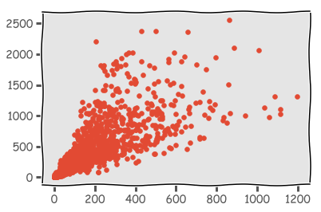


```python
df['MP'].describe()
```


    count    1173.000000
    mean     1097.642796
    std       840.884642
    min         1.000000
    25%       321.000000
    50%       981.000000
    75%      1774.000000
    max      3125.000000
    Name: MP, dtype: float64


```python
1500 / 82
```


    18.29268292682927


```python
df = df[df['MP'] > 1500]
```


```python
plt.figure(figsize = (12, 8))
plt.scatter(df['TRB'], df['PTS'])
plt.xlabel('Rebounds')
plt.ylabel('Points')
plt.show()
```


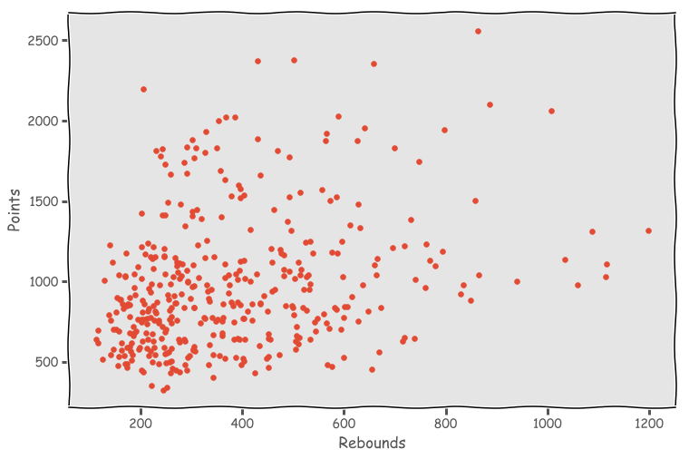


```python
my_scores = []

for x in range(2, 10):
    kmeans = KMeans(n_clusters = x)
    kmeans.fit(df[['TRB', 'PTS']])
    pred_clusters = kmeans.predict(df[['TRB', 'PTS']])
    my_scores.append(calinski_harabaz_score(df[['TRB', 'PTS']], pred_clusters))
```


```python
plt.figure(figsize = (12, 8))
plt.plot(range(2, 10), my_scores)
plt.show()
```


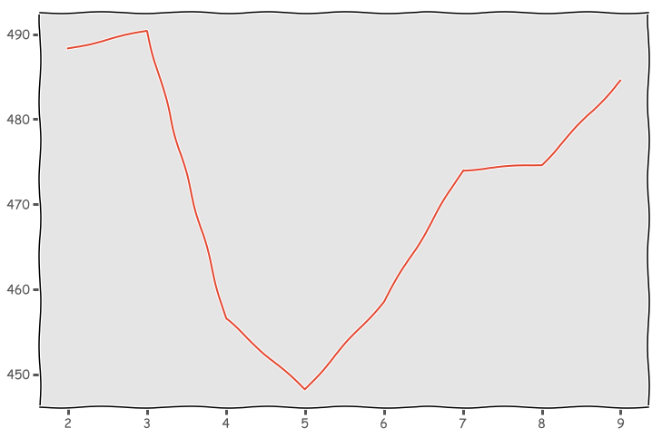


```python
plt.figure(figsize = (12, 8))
kmeans = KMeans(n_clusters = 2)
kmeans.fit(df[['TRB', 'PTS']])
pred_clusters = kmeans.predict(df[['TRB', 'PTS']])
plt.scatter(df['TRB'], df['PTS'], c = pred_clusters)
plt.scatter(kmeans.cluster_centers_[:, 0], kmeans.cluster_centers_[:,1], color = 'red', s = 200)
plt.show()
```


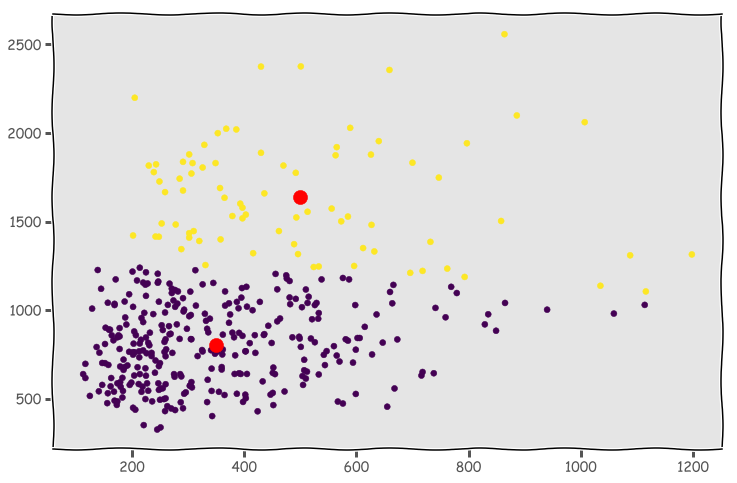


```python
plt.figure(figsize = (12, 8))
kmeans = KMeans(n_clusters = 3)
kmeans.fit(df[['TRB', 'PTS']])
pred_clusters = kmeans.predict(df[['TRB', 'PTS']])
plt.scatter(df['TRB'], df['PTS'], c = pred_clusters)
plt.scatter(kmeans.cluster_centers_[:, 0], kmeans.cluster_centers_[:,1], color = 'red', s = 200)
plt.show()
```


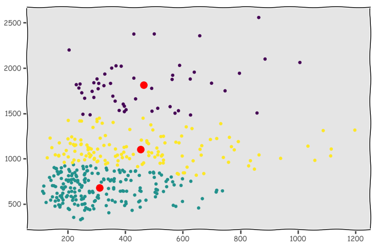


```python
plt.figure(figsize = (12, 8))
kmeans = KMeans(n_clusters = 9)
kmeans.fit(df[['TRB', 'PTS']])
pred_clusters = kmeans.predict(df[['TRB', 'PTS']])
plt.scatter(df['TRB'], df['PTS'], c = pred_clusters, label = {'cyan': 'Cluster 1'})
plt.scatter(kmeans.cluster_centers_[:, 0], kmeans.cluster_centers_[:,1], color = 'red', s = 200)
plt.legend()
plt.show()
```


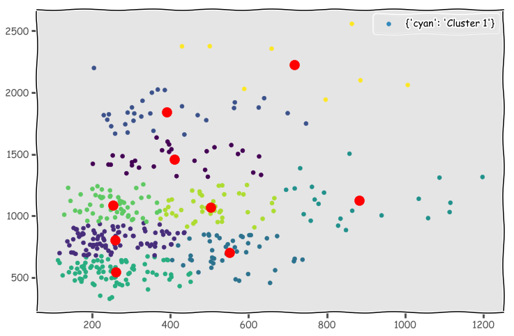


```python
kmeans.cluster_centers_
```


    array([[ 503.36585366, 1070.65853659],
           [ 321.27272727, 1841.90909091],
           [ 249.22666667,  534.74666667],
           [ 410.9       , 1466.7       ],
           [ 253.34615385, 1082.69230769],
           [ 683.85714286, 2071.57142857],
           [ 245.88888889,  805.35802469],
           [ 882.61904762, 1125.33333333],
           [ 517.19298246,  701.66666667]])


```python
pred_clusters.shape
```


    (393,)


```python
df.shape
```


    (393, 53)


```python
df.head()
```


<div>
<style scoped>
    .dataframe tbody tr th:only-of-type {
        vertical-align: middle;
    }

    .dataframe tbody tr th {
        vertical-align: top;
    }

    .dataframe thead th {
        text-align: right;
    }
</style>
<table border="1" class="dataframe">
  <thead>
    <tr style="text-align: right;">
      <th></th>
      <th>Unnamed: 0</th>
      <th>Year</th>
      <th>Player</th>
      <th>Pos</th>
      <th>Age</th>
      <th>Tm</th>
      <th>G</th>
      <th>GS</th>
      <th>MP</th>
      <th>PER</th>
      <th>...</th>
      <th>FT%</th>
      <th>ORB</th>
      <th>DRB</th>
      <th>TRB</th>
      <th>AST</th>
      <th>STL</th>
      <th>BLK</th>
      <th>TOV</th>
      <th>PF</th>
      <th>PTS</th>
    </tr>
  </thead>
  <tbody>
    <tr>
      <th>23519</th>
      <td>23519</td>
      <td>2016.0</td>
      <td>Steven Adams</td>
      <td>C</td>
      <td>22.0</td>
      <td>OKC</td>
      <td>80.0</td>
      <td>80.0</td>
      <td>2014.0</td>
      <td>15.5</td>
      <td>...</td>
      <td>0.582</td>
      <td>219.0</td>
      <td>314.0</td>
      <td>533.0</td>
      <td>62.0</td>
      <td>42.0</td>
      <td>89.0</td>
      <td>84.0</td>
      <td>223.0</td>
      <td>636.0</td>
    </tr>
    <tr>
      <th>23520</th>
      <td>23520</td>
      <td>2016.0</td>
      <td>Arron Afflalo</td>
      <td>SG</td>
      <td>30.0</td>
      <td>NYK</td>
      <td>71.0</td>
      <td>57.0</td>
      <td>2371.0</td>
      <td>10.9</td>
      <td>...</td>
      <td>0.840</td>
      <td>23.0</td>
      <td>243.0</td>
      <td>266.0</td>
      <td>144.0</td>
      <td>25.0</td>
      <td>10.0</td>
      <td>82.0</td>
      <td>142.0</td>
      <td>909.0</td>
    </tr>
    <tr>
      <th>23523</th>
      <td>23523</td>
      <td>2016.0</td>
      <td>LaMarcus Aldridge</td>
      <td>PF</td>
      <td>30.0</td>
      <td>SAS</td>
      <td>74.0</td>
      <td>74.0</td>
      <td>2261.0</td>
      <td>22.4</td>
      <td>...</td>
      <td>0.858</td>
      <td>176.0</td>
      <td>456.0</td>
      <td>632.0</td>
      <td>110.0</td>
      <td>38.0</td>
      <td>81.0</td>
      <td>99.0</td>
      <td>151.0</td>
      <td>1331.0</td>
    </tr>
    <tr>
      <th>23525</th>
      <td>23525</td>
      <td>2016.0</td>
      <td>Lavoy Allen</td>
      <td>PF</td>
      <td>26.0</td>
      <td>IND</td>
      <td>79.0</td>
      <td>28.0</td>
      <td>1599.0</td>
      <td>12.4</td>
      <td>...</td>
      <td>0.630</td>
      <td>162.0</td>
      <td>262.0</td>
      <td>424.0</td>
      <td>76.0</td>
      <td>26.0</td>
      <td>42.0</td>
      <td>69.0</td>
      <td>147.0</td>
      <td>428.0</td>
    </tr>
    <tr>
      <th>23526</th>
      <td>23526</td>
      <td>2016.0</td>
      <td>Tony Allen</td>
      <td>SG</td>
      <td>34.0</td>
      <td>MEM</td>
      <td>64.0</td>
      <td>57.0</td>
      <td>1620.0</td>
      <td>12.9</td>
      <td>...</td>
      <td>0.652</td>
      <td>104.0</td>
      <td>192.0</td>
      <td>296.0</td>
      <td>70.0</td>
      <td>110.0</td>
      <td>18.0</td>
      <td>78.0</td>
      <td>175.0</td>
      <td>535.0</td>
    </tr>
  </tbody>
</table>
<p>5 rows × 53 columns</p>
</div>


```python
df_1 = df[['TRB', 'PTS']]
```


```python
df_1.head()
```


<div>
<style scoped>
    .dataframe tbody tr th:only-of-type {
        vertical-align: middle;
    }

    .dataframe tbody tr th {
        vertical-align: top;
    }

    .dataframe thead th {
        text-align: right;
    }
</style>
<table border="1" class="dataframe">
  <thead>
    <tr style="text-align: right;">
      <th></th>
      <th>TRB</th>
      <th>PTS</th>
    </tr>
  </thead>
  <tbody>
    <tr>
      <th>23519</th>
      <td>533.0</td>
      <td>636.0</td>
    </tr>
    <tr>
      <th>23520</th>
      <td>266.0</td>
      <td>909.0</td>
    </tr>
    <tr>
      <th>23523</th>
      <td>632.0</td>
      <td>1331.0</td>
    </tr>
    <tr>
      <th>23525</th>
      <td>424.0</td>
      <td>428.0</td>
    </tr>
    <tr>
      <th>23526</th>
      <td>296.0</td>
      <td>535.0</td>
    </tr>
  </tbody>
</table>
</div>


```python
df_1['Cluster'] = pred_clusters
```

    /Users/jeffreyherman/anaconda3/lib/python3.6/site-packages/ipykernel_launcher.py:1: SettingWithCopyWarning: 
    A value is trying to be set on a copy of a slice from a DataFrame.
    Try using .loc[row_indexer,col_indexer] = value instead
    
    See the caveats in the documentation: http://pandas.pydata.org/pandas-docs/stable/indexing.html#indexing-view-versus-copy
      """Entry point for launching an IPython kernel.


```python
df_1.head()
```


<div>
<style scoped>
    .dataframe tbody tr th:only-of-type {
        vertical-align: middle;
    }

    .dataframe tbody tr th {
        vertical-align: top;
    }

    .dataframe thead th {
        text-align: right;
    }
</style>
<table border="1" class="dataframe">
  <thead>
    <tr style="text-align: right;">
      <th></th>
      <th>TRB</th>
      <th>PTS</th>
      <th>Cluster</th>
    </tr>
  </thead>
  <tbody>
    <tr>
      <th>23519</th>
      <td>533.0</td>
      <td>636.0</td>
      <td>8</td>
    </tr>
    <tr>
      <th>23520</th>
      <td>266.0</td>
      <td>909.0</td>
      <td>6</td>
    </tr>
    <tr>
      <th>23523</th>
      <td>632.0</td>
      <td>1331.0</td>
      <td>3</td>
    </tr>
    <tr>
      <th>23525</th>
      <td>424.0</td>
      <td>428.0</td>
      <td>2</td>
    </tr>
    <tr>
      <th>23526</th>
      <td>296.0</td>
      <td>535.0</td>
      <td>2</td>
    </tr>
  </tbody>
</table>
</div>


```python
kmeans.cluster_centers_
```


    array([[ 503.36585366, 1070.65853659],
           [ 321.27272727, 1841.90909091],
           [ 249.22666667,  534.74666667],
           [ 410.9       , 1466.7       ],
           [ 253.34615385, 1082.69230769],
           [ 683.85714286, 2071.57142857],
           [ 245.88888889,  805.35802469],
           [ 882.61904762, 1125.33333333],
           [ 517.19298246,  701.66666667]])


```python
import seaborn as sns
```


```python
sns.lmplot(data = df_1, x = 'TRB', y = 'PTS', hue = 'Cluster', legend = True, fit_reg = False)
plt.show()
```


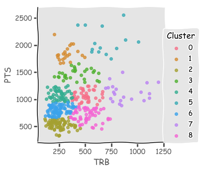


```python
from sklearn.datasets import make_blobs
from sklearn.cluster import KMeans
from sklearn.metrics import silhouette_samples, silhouette_score

import matplotlib.pyplot as plt
import matplotlib.cm as cm
import numpy as np

print(__doc__)

# Generating the sample data from make_blobs
# This particular setting has one distinct cluster and 3 clusters placed close
# together.
X, y = make_blobs(n_samples=500,
                  n_features=2,
                  centers=4,
                  cluster_std=1,
                  center_box=(-10.0, 10.0),
                  shuffle=True,
                  random_state=1)  # For reproducibility

range_n_clusters = [2, 3, 4, 5, 6]

for n_clusters in range_n_clusters:
    # Create a subplot with 1 row and 2 columns
    fig, (ax1, ax2) = plt.subplots(1, 2)
    fig.set_size_inches(18, 7)

    # The 1st subplot is the silhouette plot
    # The silhouette coefficient can range from -1, 1 but in this example all
    # lie within [-0.1, 1]
    ax1.set_xlim([-0.1, 1])
    # The (n_clusters+1)*10 is for inserting blank space between silhouette
    # plots of individual clusters, to demarcate them clearly.
    ax1.set_ylim([0, len(X) + (n_clusters + 1) * 10])

    # Initialize the clusterer with n_clusters value and a random generator
    # seed of 10 for reproducibility.
    clusterer = KMeans(n_clusters=n_clusters, random_state=10)
    cluster_labels = clusterer.fit_predict(X)

    # The silhouette_score gives the average value for all the samples.
    # This gives a perspective into the density and separation of the formed
    # clusters
    silhouette_avg = silhouette_score(X, cluster_labels)
    print("For n_clusters =", n_clusters,
          "The average silhouette_score is :", silhouette_avg)

    # Compute the silhouette scores for each sample
    sample_silhouette_values = silhouette_samples(X, cluster_labels)

    y_lower = 10
    for i in range(n_clusters):
        # Aggregate the silhouette scores for samples belonging to
        # cluster i, and sort them
        ith_cluster_silhouette_values = \
            sample_silhouette_values[cluster_labels == i]

        ith_cluster_silhouette_values.sort()

        size_cluster_i = ith_cluster_silhouette_values.shape[0]
        y_upper = y_lower + size_cluster_i

        color = cm.nipy_spectral(float(i) / n_clusters)
        ax1.fill_betweenx(np.arange(y_lower, y_upper),
                          0, ith_cluster_silhouette_values,
                          facecolor=color, edgecolor=color, alpha=0.7)

        # Label the silhouette plots with their cluster numbers at the middle
        ax1.text(-0.05, y_lower + 0.5 * size_cluster_i, str(i))

        # Compute the new y_lower for next plot
        y_lower = y_upper + 10  # 10 for the 0 samples

    ax1.set_title("The silhouette plot for the various clusters.")
    ax1.set_xlabel("The silhouette coefficient values")
    ax1.set_ylabel("Cluster label")

    # The vertical line for average silhouette score of all the values
    ax1.axvline(x=silhouette_avg, color="red", linestyle="--")

    ax1.set_yticks([])  # Clear the yaxis labels / ticks
    ax1.set_xticks([-0.1, 0, 0.2, 0.4, 0.6, 0.8, 1])

    # 2nd Plot showing the actual clusters formed
    colors = cm.nipy_spectral(cluster_labels.astype(float) / n_clusters)
    ax2.scatter(X[:, 0], X[:, 1], marker='.', s=30, lw=0, alpha=0.7,
                c=colors, edgecolor='k')

    # Labeling the clusters
    centers = clusterer.cluster_centers_
    # Draw white circles at cluster centers
    ax2.scatter(centers[:, 0], centers[:, 1], marker='o',
                c="white", alpha=1, s=200, edgecolor='k')

    for i, c in enumerate(centers):
        ax2.scatter(c[0], c[1], marker='$%d$' % i, alpha=1,
                    s=50, edgecolor='k')

    ax2.set_title("The visualization of the clustered data.")
    ax2.set_xlabel("Feature space for the 1st feature")
    ax2.set_ylabel("Feature space for the 2nd feature")

    plt.suptitle(("Silhouette analysis for KMeans clustering on sample data "
                  "with n_clusters = %d" % n_clusters),
                 fontsize=14, fontweight='bold')

plt.show()
```

    Automatically created module for IPython interactive environment
    For n_clusters = 2 The average silhouette_score is : 0.7049787496083262
    For n_clusters = 3 The average silhouette_score is : 0.5882004012129721
    For n_clusters = 4 The average silhouette_score is : 0.6505186632729437
    For n_clusters = 5 The average silhouette_score is : 0.56376469026194
    For n_clusters = 6 The average silhouette_score is : 0.4504666294372765


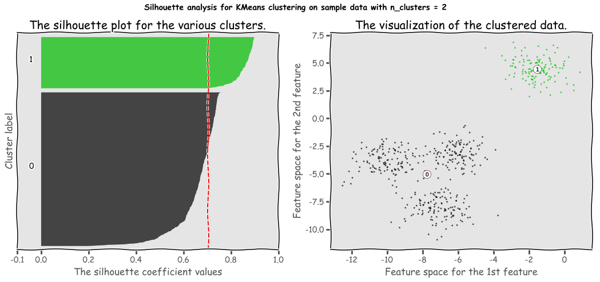


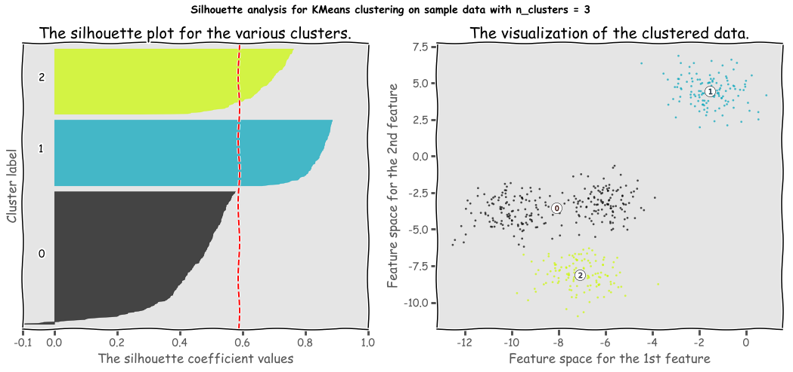


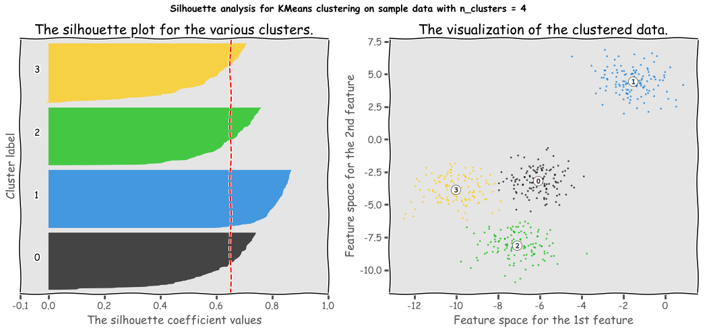


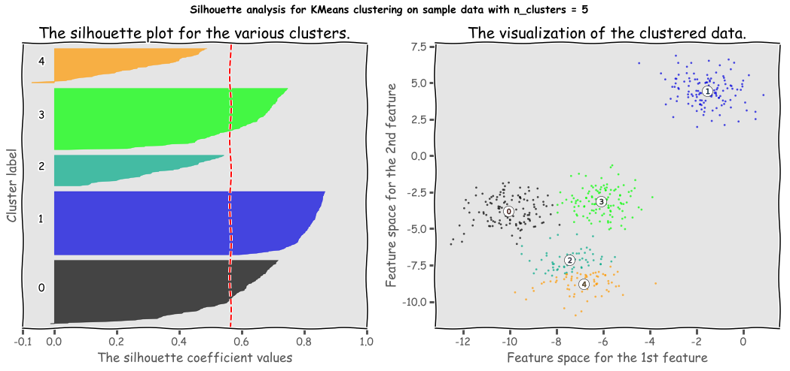


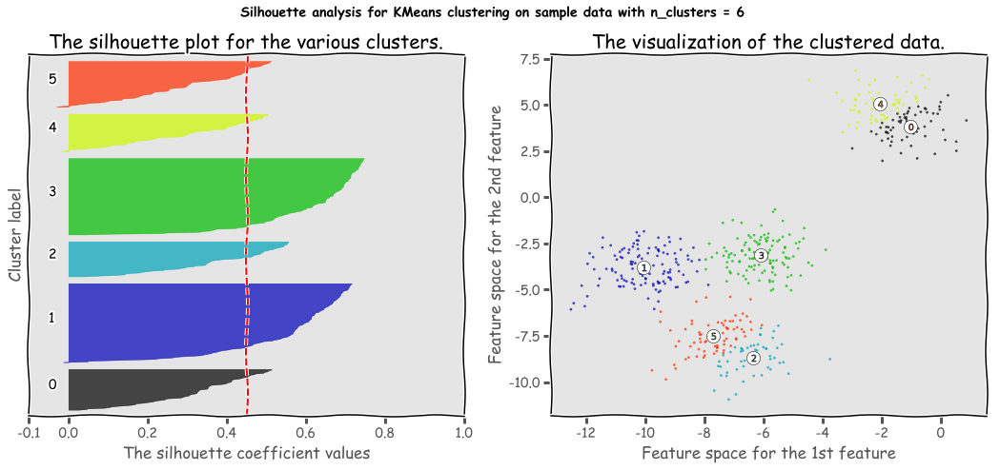

